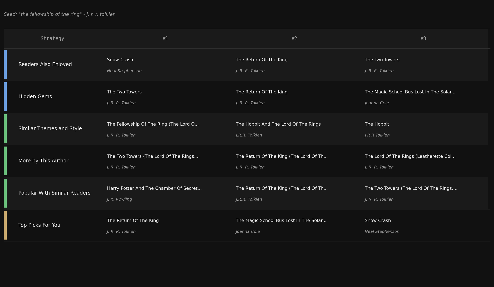
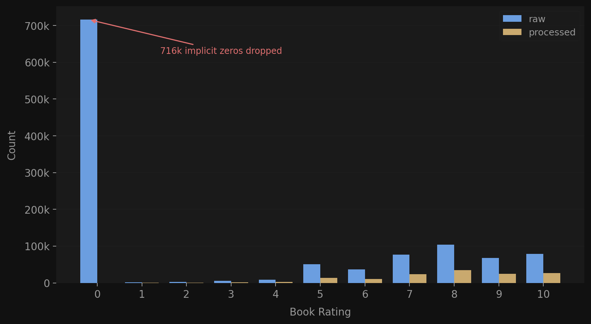
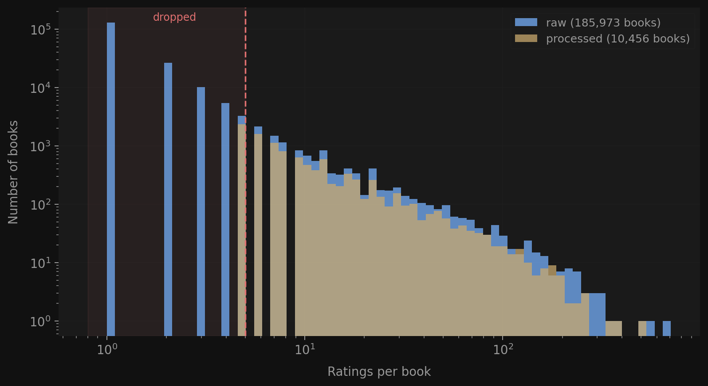
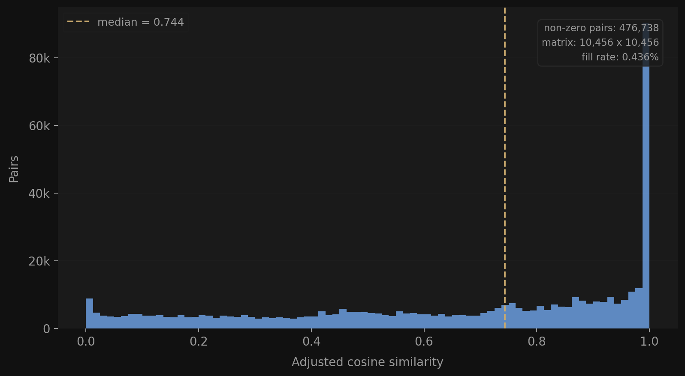
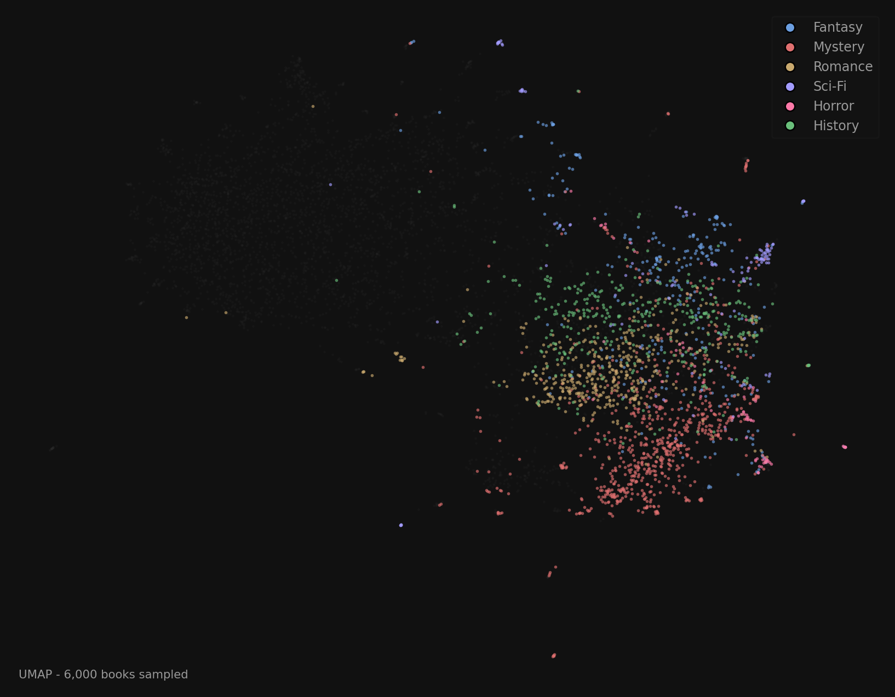
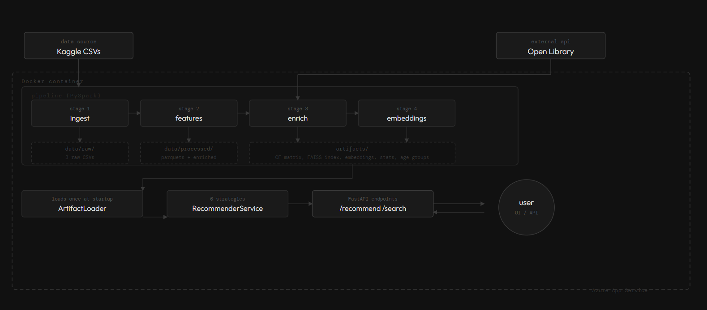
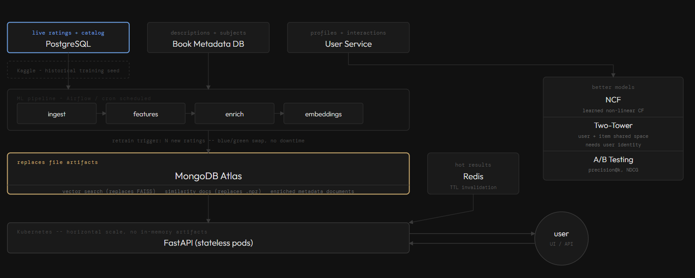
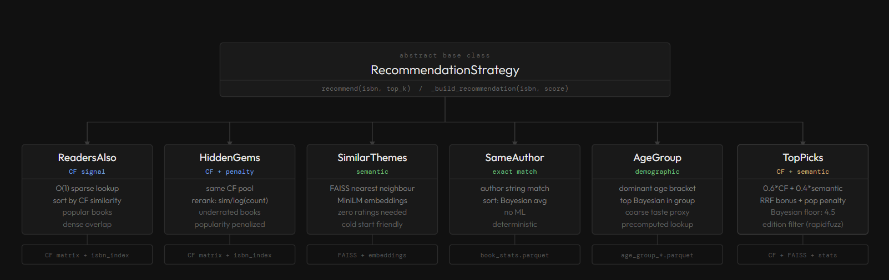

# Book Recommender

A book recommendation system built on the [Book-Crossings dataset](https://www.kaggle.com/datasets/arashnic/book-recommendation-dataset?select=Ratings.csv). Given a seed book, it returns recommendations across six complementary strategies: collaborative filtering, semantic search, author matching, and demographic lookups.

Try the interactive demo: [https://rma0.infinityfreeapp.com/](https://rma0.infinityfreeapp.com/)

## Strategies

| Strategy | Description |
|---|---|
| **Readers Also Enjoyed** | Item-item collaborative filtering; O(1) lookup via a precomputed sparse similarity matrix |
| **Hidden Gems** | CF-based candidates re-ranked to surface books with high similarity but low popularity |
| **Similar Themes and Style** | FAISS nearest-neighbour search over MiniLM sentence embeddings of title, description, and subjects |
| **More by This Author** | Exact author match sorted by Bayesian average rating |
| **Popular With Similar Readers** | Finds the seed book's dominant age group, returns top-rated books in that group |
| **Top Picks For You** | Multi-signal fusion of CF and semantic scores, with reciprocal rank fusion bonus for books appearing in both lists and a mild popularity penalty |



## Requirements

- Python >= 3.11
- [uv](https://docs.astral.sh/uv/) (package and environment manager)

| Package | Purpose |
|---|---|
| Base dependencies | Recommendation CLI, FastAPI app, artifact loading |
| `pyspark` | Distributed data processing for the pipeline |
| `pandas` / `pyarrow` | Parquet I/O and in-memory operations |
| `scipy` | Sparse matrix storage and operations |
| `faiss-cpu` | Approximate nearest-neighbour FAISS index |
| `sentence-transformers` | MiniLM embedding model |
| `numpy` | Numerical arrays |
| `httpx` | Async HTTP client for Open Library API |
| `rapidfuzz` | Fuzzy string matching for book search |

## Installation and Run

Clone the repository first:

```bash
git clone https://github.com/rm-a0/book-recommender
cd book-recommender
```

### Data Prerequisites

Pipeline commands expect the Book-Crossings CSV files to exist in `data/raw/`:

- `Books.csv`
- `Ratings.csv`
- `Users.csv`

You can place them there manually, or use the helper script:

```bash
uv sync --group dev
uv run python scripts/download_data.py
```

### Pipeline

Install the pipeline extras, then run the full build or an individual stage:

```bash
uv sync --group pipeline

# Full pipeline (ingest -> features -> enrich -> embeddings)
uv run python main.py pipeline

# Individual stages
uv run python main.py ingest
uv run python main.py features
uv run python main.py enrich
uv run python main.py embeddings
```

### Recommend

The recommendation CLI only needs the base dependency set from `pyproject.toml`:

```bash
uv sync
uv run python main.py recommend "The Fellowship of the Ring"
```

### App

The FastAPI app also runs on the base dependency set:

```bash
uv sync
uv run python main.py app
```

Then open:

- `http://localhost:8000/health`
- `http://localhost:8000/docs`

### Docker Run

Docker uses the exported runtime dependencies from `requirements.txt`, not the pipeline extras.

Before running Docker, make sure the runtime data already exists locally:

- `artifacts/` must contain the precomputed recommendation artifacts
- `data/processed/` must contain the processed parquet/cache files

If you are starting from raw CSVs only, run the local pipeline first. The container serves the API; it does not build the pipeline artifacts.

```bash
docker compose up --build
```

Then open:

- `http://localhost:8000/health`
- `http://localhost:8000/docs`

## Azure Deployment

- Demo app: [https://rma0.infinityfreeapp.com/](https://rma0.infinityfreeapp.com/)
- Deployed API: [https://book-recommender-api.azurewebsites.net](https://book-recommender-api.azurewebsites.net)
- Swagger UI: [https://book-recommender-api.azurewebsites.net/docs](https://book-recommender-api.azurewebsites.net/docs)

## Project Structure

```
book-recommender/
│
├── main.py                      # CLI entry point for pipeline, recommend, and app
├── src/
│   ├── config.py                # Paths, thresholds, and hyperparameters
│   │
│   ├── pipeline/
│   │   ├── schemas.py           # PySpark StructType schemas for raw CSVs
│   │   ├── utils.py             # SparkSession factory and Parquet writer
│   │   ├── ingest.py            # Stage 1: read CSVs, clean, write parquets
│   │   ├── clean.py             # Cleaning functions (ratings, books, users)
│   │   ├── features.py          # Stage 2: CF matrix, book stats, age-group artifacts
│   │   ├── enrich.py            # Stage 3: Open Library enrichment (descriptions + subjects)
│   │   └── embeddings.py        # Stage 4: sentence embeddings + FAISS index
│   │
│   ├── recommender/
│   │   ├── loader.py            # ArtifactLoader: loads all artifacts from disk
│   │   ├── base.py              # Recommendation dataclass and strategy ABC
│   │   ├── registry.py          # StrategyRegistry: holds and exposes all strategies
│   │   ├── service.py           # RecommenderService: search + recommend facade
│   │   ├── readers_also.py      # Strategy: item-item CF similarity lookup
│   │   ├── hidden_gems.py       # Strategy: CF re-ranked by inverse popularity
│   │   ├── similar_themes.py    # Strategy: FAISS semantic nearest-neighbour search
│   │   ├── same_author.py       # Strategy: exact author match sorted by Bayesian rating
│   │   ├── age_group.py         # Strategy: demographic age-group top books
│   │   └── top_picks.py         # Strategy: CF + semantic fusion with RRF
│   │
│   └── api/                     # FastAPI app, endpoints, and response schemas
│
├── data/
│   ├── raw/                     # Original CSVs (Books.csv, Ratings.csv, Users.csv)
│   └── processed/               # Cleaned parquets and Open Library cache
│
├── artifacts/                   # Computed ML artifacts (parquets, matrices, embeddings)
├── notebooks/                   # Exploratory Jupyter notebooks
├── scripts/                     # Utility scripts
├── Dockerfile                   # Container image for API service
├── docker-compose.yml           # Local container run
├── docs/                        # Deployment and production notes
└── tests/                       # Strategy comparison scripts
```

## Pipeline

Four sequential stages, each reading from the previous stage's outputs.

### Stage 1: Ingest

Reads the three raw CSVs, cleans them, and writes processed Parquet files to `data/processed/`.

**`books.parquet`**

| Field | Type | Notes |
|---|---|---|
| `ISBN` | string | Primary key |
| `Book-Title` | string | Lowercased, whitespace-trimmed |
| `Book-Author` | string | Lowercased, whitespace-trimmed |
| `Year-Of-Publication` | int (nullable) | Values outside 1500-2025 set to null |
| `Publisher` | string | |
| `Image-URL-S/M/L` | string | Cover image URLs |

Cleaning: editions with the same title + author collapsed to the one with most ratings; books with fewer than 5 ratings dropped.

**`ratings.parquet`**

| Field | Type | Notes |
|---|---|---|
| `User-ID` | int | |
| `ISBN` | string | |
| `Book-Rating` | int | Explicit ratings 1-10 only; implicit 0-ratings removed |

Cleaning: duplicate `(User-ID, ISBN)` pairs dropped; users with fewer than 3 ratings dropped.

**`users.parquet`**

| Field | Type | Notes |
|---|---|---|
| `User-ID` | int | Primary key |
| `Location` | string | Free-text |
| `Age` | int (nullable) | Clamped to 13-100; out-of-range values set to null |

Data cleaning results: 271k raw books -> 22k after cleaning; 1.1M ratings -> 433k explicit ratings.





### Stage 2: Features

Builds all ML artifacts from cleaned parquets. Outputs to `artifacts/`.

**`book_stats.parquet`** - books joined with per-ISBN rating stats:

| Field | Type | Notes |
|---|---|---|
| `ISBN` | string | |
| `Book-Title` / `Book-Author` | string | |
| `rating_count` | int | Number of explicit ratings |
| `rating_mean` | float | Arithmetic mean rating |
| `bayesian_rating` | float | `(v/(v+m)) * R + (m/(v+m)) * C` where `m` = 25th percentile of rating counts, `C` = global mean |

**`age_group_dominant.parquet`** - dominant age bracket per book:

| Field | Type | Notes |
|---|---|---|
| `ISBN` | string | |
| `dominant_age_group` | string | e.g. `"25-34"` |
| `age_group_count` | int | Number of raters in that bracket |

Age brackets: `13-17`, `18-24`, `25-34`, `35-44`, `45-54`, `55+`

**`age_group_top_books.parquet`** - top books per age group (used by the age group strategy)

**`isbn_index.json`** - `{isbn: integer_index}` mapping into CF matrix rows/columns

**`item_similarity.npz`** - symmetric scipy CSR sparse matrix of item-item adjusted cosine similarities; only pairs with at least 2 common raters and similarity > 0.0 stored



### Stage 3: Enrich

Fetches descriptions and subject tags from the Open Library API.

- Batches of 100 ISBNs, up to 10 concurrent requests
- Results cached to `data/processed/openlibrary_cache.json`
- Falls back to `"Title by Author"` when no description is available

**`book_metadata_enriched.parquet`**

| Field | Type | Notes |
|---|---|---|
| `ISBN` | string | |
| `Book-Title` / `Book-Author` | string | |
| `description` | string | Open Library description or fallback |
| `subjects` | string | Up to 20 subject tags, comma-separated |

### Stage 4: Embeddings

Encodes each book into a 384-dimensional sentence embedding using `all-MiniLM-L6-v2`.

- Input text format: `"Title by Author. Description. Genres: subjects"`
- Embeddings are L2-normalised so inner product = cosine similarity

| Artifact | Description |
|---|---|
| `book_embeddings.npy` | Float32 array of shape `(N, 384)` |
| `faiss_index.bin` | Serialised FAISS `IndexFlatIP` (exact cosine search) |
| `embedding_isbn_map.json` | ISBN list; position `i` corresponds to row `i` in embeddings |



## Architecture

### Current Architecture

The system currently uses a containerised approach with PySpark for data processing and FastAPI for serving recommendations.

**Data Flow:**

1. **Raw Data Ingestion**: CSV files from Kaggle (271k books, 1.1M ratings, 278k users)
2. **PySpark Pipeline**: Four-stage distributed processing (ingest, features, enrich, embeddings)
3. **Artifact Generation**: Produces CF matrices, FAISS indexes, embeddings, and statistics
4. **FastAPI Service**: Loads precomputed artifacts once at startup (`ArtifactLoader`)
5. **Strategy Registry**: Six recommendation strategies available via unified service interface
6. **REST API**: Endpoints for search, lookup, health checks, and recommendations

All artifacts are held in memory within the Docker container. Scaling requires replicating the entire container, which loads its own copy of all artifacts.



### Production Architecture (Proposed)

For production deployment at scale, the architecture evolves to address in-memory artifact limitations.

**Key Improvements:**

1. **PostgreSQL**: Live ratings and catalog data replaces CSV dependency
2. **Book Metadata DB**: Descriptions and subjects via queryable database
3. **MongoDB Atlas**: Centralised artifact storage with vector search
   - Replaces `item_similarity.npz` with distributed similarity documents
   - Replaces FAISS in-memory index with MongoDB vector search
   - Stores enriched metadata and precomputed statistics
4. **Redis**: Hot result caching with TTL invalidation
5. **Kubernetes**: Stateless FastAPI pods scale horizontally without in-memory artifacts
6. **Airflow/Cron**: Scheduled ML pipeline retraining with blue-green deployment and zero downtime

This architecture decouples stateless API servers from stateful ML artifacts, enabling true horizontal scaling and continuous model updates.



### Strategy Pattern

All recommendation strategies inherit from a common `RecommendationStrategy` abstract base class. This enables runtime registration, composition, and testing.



**Design Benefits:**

- New strategies can be added by creating one file and one `register()` call
- Strategies are loosely coupled to their artifacts via dependency injection
- `RecommenderService` composes strategies without knowing implementation details
- Testing and mocking is straightforward for strategy comparison

## Recommender

All strategies implement the `RecommendationStrategy` ABC and return `Recommendation` objects with: `isbn`, `title`, `author`, `score`, `strategy`, `description`, `subjects`, `rating_count`, `bayesian_rating`.

| Strategy | Algorithm | Key Inputs | Score |
|---|---|---|---|
| `readers_also` | Item-item adjusted cosine CF; O(1) sparse matrix row lookup | `item_similarity.npz`, `isbn_index.json` | Adjusted cosine similarity |
| `hidden_gems` | Top-100 CF candidates re-ranked by `cf_sim / log(1 + rating_count)` | CF matrix + `book_stats` | Popularity-penalised CF score |
| `similar_themes` | FAISS `IndexFlatIP` nearest-neighbour over MiniLM embeddings | `faiss_index.bin`, `book_embeddings.npy` | Cosine similarity (0-1) |
| `same_author` | Exact `Book-Author` match sorted by Bayesian average rating | `book_stats` | Bayesian rating |
| `age_group` | Seed's dominant age group -> top-rated books in that group | `age_group_dominant.parquet`, `age_group_top_books.parquet` | Bayesian rating |
| `top_picks` | Linear fusion of CF + semantic scores (alpha=0.6/0.4) with RRF bonus and `log(1 + 0.3*rating_count)` popularity penalty | CF matrix + FAISS + `book_stats` | Fused score |

The `RecommenderService` exposes:

- `search_books(query)` - case-insensitive substring search; exact matches ranked first, both groups sorted by `rating_count` descending
- `get_book(isbn)` - lookup by ISBN
- `recommend(isbn, strategy, top_k)` - single strategy
- `recommend_all(isbn, top_k)` - all six strategies in registry order

## API

The API is a thin FastAPI layer over `RecommenderService`. On startup it loads the service once in the application lifespan and exposes search, lookup, and recommendation endpoints on port `8000`.

### Endpoints

| Method | Path | Purpose | Notes |
|---|---|---|---|
| `GET` | `/health` | Service health and artifact readiness | Returns whether CF and embedding artifacts are available |
| `GET` | `/strategies` | List registered strategies | Mirrors the strategy registry exposed by `RecommenderService` |
| `GET` | `/books/search` | Search books by title substring | Query params: `q`, `max_results` (1-50) |
| `GET` | `/books/{isbn}` | Fetch one book | Returns 404 if the ISBN is unknown |
| `POST` | `/recommend` | Run all strategies for one seed book | Seed can be supplied by `isbn` or `book_title` |
| `POST` | `/recommend/{strategy}` | Run one named strategy | Returns 400 for an unknown strategy |

### Request Model

Recommendation endpoints accept the same request body:

| Field | Type | Notes |
|---|---|---|
| `book_title` | string \| null | Optional; title search is used when `isbn` is not provided |
| `isbn` | string \| null | Optional; direct seed lookup |
| `top_k` | int | Defaults to `10`; allowed range is `1-50` |

Validation rule: at least one of `book_title` or `isbn` must be present.

Example:

```bash
curl -X POST http://localhost:8000/recommend \
	-H "Content-Type: application/json" \
	-d '{"book_title":"The Fellowship of the Ring","top_k":10}'
```

### Response Models

**`GET /health`**

| Field | Type | Notes |
|---|---|---|
| `status` | string | Expected value: `"ok"` |
| `has_cf` | bool | Whether collaborative-filtering artifacts loaded successfully |
| `has_embeddings` | bool | Whether embedding artifacts loaded successfully |
| `strategy_count` | int | Number of registered recommendation strategies |

**`GET /books/search` and `GET /books/{isbn}`** return `BookSchema` objects:

| Field | Type | Notes |
|---|---|---|
| `isbn` | string | Book identifier |
| `title` | string | Normalised book title |
| `author` | string | Normalised author name |
| `rating_count` | int | Explicit rating count |
| `bayesian_rating` | float | Precomputed Bayesian average rating |

**`POST /recommend/{strategy}`** returns one `StrategyResultSchema`:

| Field | Type | Notes |
|---|---|---|
| `strategy_name` | string | Internal strategy key, for example `readers_also` |
| `strategy_label` | string | Human-readable label |
| `strategy_description` | string | Short description shown in API/UI clients |
| `recommendations` | list[`RecommendationSchema`] | Ordered strategy output |

**`POST /recommend`** returns a `RecommendAllResponse`:

| Field | Type | Notes |
|---|---|---|
| `seed_book` | `BookSchema` | Resolved input seed |
| `strategies` | list[`StrategyResultSchema`] | One entry per registered strategy |

Each `RecommendationSchema` contains:

| Field | Type | Notes |
|---|---|---|
| `isbn` | string | Recommended book identifier |
| `title` | string | Recommended book title |
| `author` | string | Recommended book author |
| `score` | float | Strategy-specific ranking score |
| `strategy` | string | Strategy key attached to the recommendation |
| `description` | string | Enriched Open Library description when available |
| `subjects` | string | Comma-separated subject tags |
| `rating_count` | int | Explicit rating count |
| `bayesian_rating` | float | Bayesian average rating |

Swagger UI is available at [https://book-recommender-api.azurewebsites.net/docs](https://book-recommender-api.azurewebsites.net/docs).
